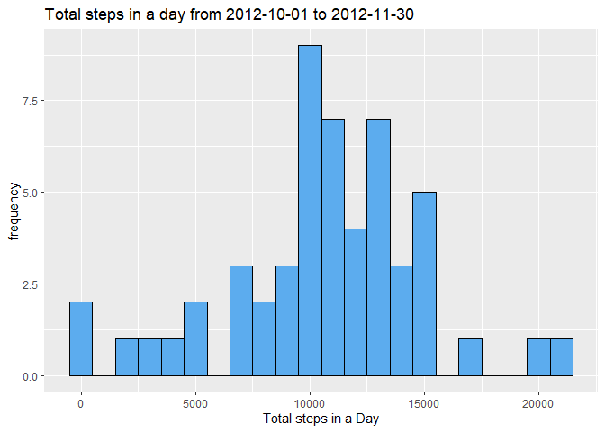
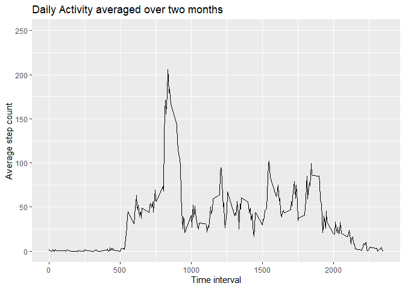
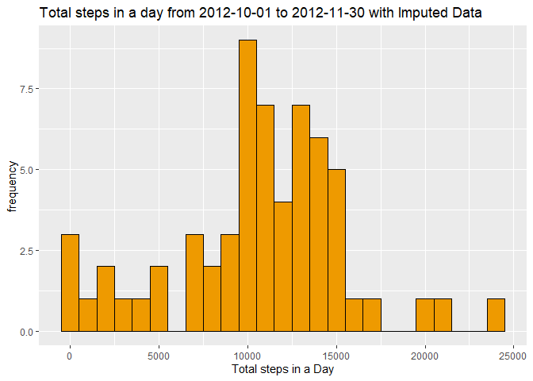
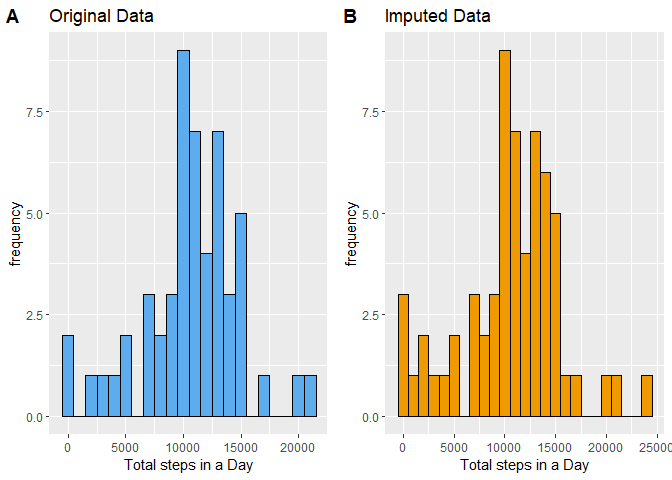
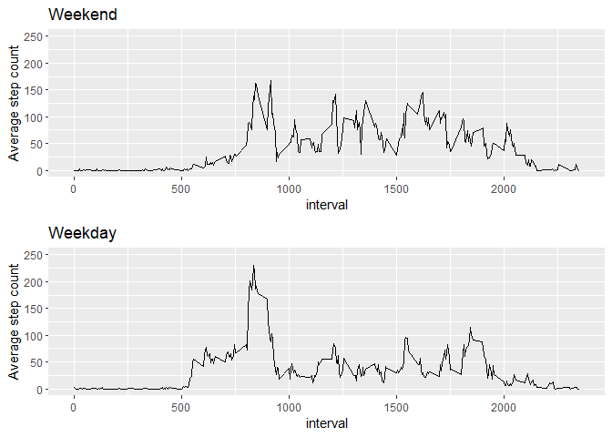

## Loading and preprocessing the data


```r
#Load necessary libraries
library(downloader)
library(dplyr)
library(plyr)
library(ggplot2)
library(lubridate)
library(cowplot)
library(xtable)

URL<-"https://d396qusza40orc.cloudfront.net/repdata%2Fdata%2Factivity.zip"
```

Data for this analysis was obtained from the URL: https://d396qusza40orc.cloudfront.net/repdata%2Fdata%2Factivity.zip


Data was downloaded at **Wed Feb 17 6:36:40 PM 2021**, at which point this report was also generated.

Data was then tidied for analysis


```r
# Download, unzip, and read the data. Additionally, rename the columns
download(URL, dest="./activity.zip", mode='wb')
unzip("./activity.zip")
activity<-read.csv("./activity.csv")
colnames(activity)<-c('StepsCount', 'Date', 'Time')

#Make the date column actually into a date class object
activity$Date<-ymd(activity$Date)

#Turn the time interval into a factor for now, as this makes it easier to calculate means per interval
activity$Time<-as.factor(activity$Time)
```


## What is mean total number of steps taken per day?


```r
#Calculate the total number of steps taken each day
sums<-tapply(activity$StepsCount, activity$Date, sum)
StepCountSum<-summary(sums)
sums<-data.frame(sums)
#Calculate the Mean
mean<-mean(sums[,1], na.rm = T)
meanchar<-as.integer(mean)
#Calculate the Median
median<-median(sums[,1], na.rm=T)
medianchar<-as.integer(median)
```

The mean number of steps taken each day is **10766**, with a median of **10765**.


```r
OGhist<-ggplot(sums, aes(x=sums))+
        geom_histogram(color="black", fill="steelblue2", binwidth = 1000)+
        xlab("Total steps in a Day")+
        ylab("frequency")+
        labs(title = "Total steps in a day from 2012-10-01 to 2012-11-30")
OGhist
```

<!-- -->

## What is the average daily activity pattern?

The average daily activity pattern can be seen below  

```r
means<-tapply(activity$StepsCount, activity$Time, mean, na.rm=T)

interval<-c(as.character(unique(activity$Time)))
interval<-as.numeric(interval)

means<-data.frame(cbind(means, interval))


OGActivity<-ggplot(means, aes(x=interval, y=means))+
        geom_line()+
        xlab("Time interval")+
        ylab("Average step count")+
        labs(title = "Daily Activity averaged over two months")+
        ylim(c(0,250))
OGActivity
```

<!-- -->

```r
#Calculate which interval has the highest mean step count
maxint<-which.max(means$means)
#assign the highest mean value to highestmean to report in R markdown
highestmean<-means[maxint,1]
#assign the intervial with the highest mean to highestinterval to report in Rmarkdown
highestinterval<-means[maxint,2]
```

The time interval with the highest mean step count is **835** with a mean of **206.1698113**. 

## Imputing missing values


```r
#How many missing values are present in the original data set?
misscount<-sum(is.na(activity$StepsCount))
```

In the original data set, there are a total of **2304** missing values. 

For further analyses, these missing values are to be imputed using the mean step count for that time interval. 

A new dataset containing these imputed values was then created.


```r
#Impute missing values
#First, select out data points where there is an na value
MissVal<-activity[is.na(activity$StepsCount), ]
MissVal$Time<-as.numeric(as.character(MissVal$Time))
#Match the intervals to the average of that interval as previously calculated
#rename the means dataframe to match the Time column
colnames(means)<-c('means', 'Time')
MissVal<-merge(MissVal, means)
#Now there is a column of the average step count at each interval
#remove column of na StepsCount values
MissVal<-select(MissVal, -StepsCount)
#Now the column of means will serve as our imputed values where there was na
#Restore original names, and reorder data frame to match activity dataframe
colnames(MissVal)<-c('Time', 'Date', 'StepsCount')
MissVal<-MissVal[, c(3,2,1)]

#Select data points where there are no na values
PresVal<-activity[!is.na(activity$StepsCount), ]

#Merge data without na values to the newly imputed dataframe to create a full data set with imputed values
activityImp<-rbind(PresVal, MissVal)

#Calculate the total number of steps taken each day
sumsImp<-tapply(activityImp$StepsCount, activity$Date, sum)
StepCountSumImp<-summary(sumsImp)
sumsImp<-data.frame(sumsImp)
#Calculate the Mean
meanImp<-mean(sumsImp[,1], na.rm = T)
meanImpchar<-as.integer(meanImp)
#Calculate the Median
medianImp<-median(sumsImp[,1], na.rm=T)
medianImpchar<-as.integer(medianImp)
```

The mean number of steps taken each day is **10766**, with a median of **11015**.


```r
#Plot a *histogram* of total step count per day
#The assignment makes a point of stating to NOT make a barplot
ImpPlot<-ggplot(sumsImp, aes(x=sumsImp))+
        geom_histogram(color="black", fill="orange2", binwidth = 1000)+
        xlab("Total steps in a Day")+
        ylab("frequency")+
        labs(title = "Total steps in a day from 2012-10-01 to 2012-11-30 with Imputed Data")
ImpPlot
```

<!-- -->


This can be directly compared with the original data which had a mean of **10766** and median of **10765**. A visual comparison is below. 

```r
OGhist2<-ggplot(sums, aes(x=sums))+
        geom_histogram(color="black", fill="steelblue2", binwidth = 1000)+
        xlab("Total steps in a Day")+
        ylab("frequency")+
        labs(title = "Original Data")

ImpPlot2<-ggplot(sumsImp, aes(x=sumsImp))+
        geom_histogram(color="black", fill="orange2", binwidth = 1000)+
        xlab("Total steps in a Day")+
        ylab("frequency")+
        labs(title = "Imputed Data")

plot_grid(OGhist2, ImpPlot2, labels = "AUTO")
```

<!-- -->

Imputing the data in this manner seems to have a minimal impact on the mean and median values, only slightly increasing the median.  


```r
meancomp<-rbind(c(meanchar, medianchar), c(meanImpchar, medianImpchar))
colnames(meancomp)<-c('Mean','Median')
rownames(meancomp)<-c('Original data','Imputed data')
mc<-xtable(meancomp)
print(mc, type="html")
```

<!-- html table generated in R 4.0.3 by xtable 1.8-4 package -->
<!-- Wed Feb 17 18:36:42 2021 -->
<table border=1>
<tr> <th>  </th> <th> Mean </th> <th> Median </th>  </tr>
  <tr> <td align="right"> Original data </td> <td align="right"> 10766 </td> <td align="right"> 10765 </td> </tr>
  <tr> <td align="right"> Imputed data </td> <td align="right"> 10766 </td> <td align="right"> 11015 </td> </tr>
   </table>


## Are there differences in activity patterns between weekdays and weekends?

To determine this, initially a new variable must be added denoting the day of the week

Then another column was added *(here called "Workday")*, that denoted whether the data in that row was taken on a weekday or a weekend. This factor variable was then used to compare the activity patterns between weekdays and weekends, as displayed below.   

```r
#Create a weekday factor column, in this case it was done Monday through Sunday
DoW<-weekdays(activityImp$Date)
activityImp<-cbind(activityImp, DoW)
activityImp$DoW<-factor(activityImp$DoW, levels=c('Monday', 'Tuesday', 'Wednesday', 'Thursday', 'Friday', 'Saturday', 'Sunday'))
#So the Weekend is levels 6 and 7 and the weekdays are levels 1-5

#Filter out weekend days, put them in one dataframe, do the same for weekdays
wkend<-filter(activityImp, (as.integer(activityImp$DoW)>5))
wkday<-filter(activityImp, (as.integer(activityImp$DoW)<6))

#Add new column to both
wkend<-cbind(wkend, rep('weekend', length(wkend$DoW)))
colnames(wkend)[5]<-c('Workday')

wkday<-cbind(wkday, rep('weekday', length(wkday$DoW)))
colnames(wkday)[5]<-c('Workday')

#Put back together and convert it to factor
wklong<-rbind(wkday, wkend)
wklong$Workday<-factor(wklong$Workday, levels = c('weekday','weekend'))

means2<-tapply(wklong$StepsCount, list(wklong$Time, wklong$Workday), mean, na.rm=T)

means2<-data.frame(cbind(means2, interval))

wkdayplot<-ggplot(means2, aes(x=interval, y=weekday))+
        geom_line()+
        ylab("Average step count")+
        labs(title = "Weekday")+
        ylim(c(0,250))

wkendplot<-ggplot(means2, aes(x=interval, y=weekend))+
        geom_line()+
        ylab("Average step count")+
        labs(title = "Weekend")+
        ylim(c(0,250))

plot_grid(wkendplot, wkdayplot, labels = NULL, nrow = 2, ncol = 1)
```

<!-- -->
  
As you can see by the plots above, during the weekend there appears to be a more even spread of activity throughout the day, whereas on weekdays there is a higher peak of activity, but lower activity throughout the day.
